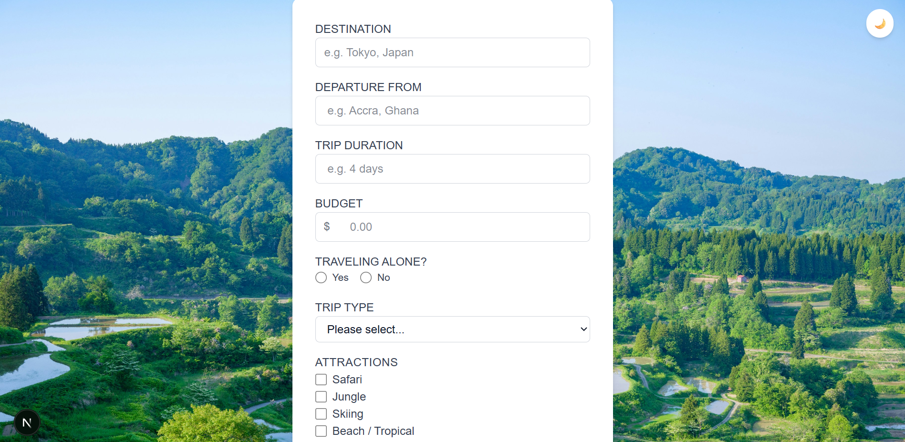
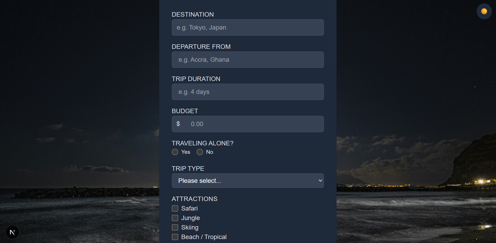
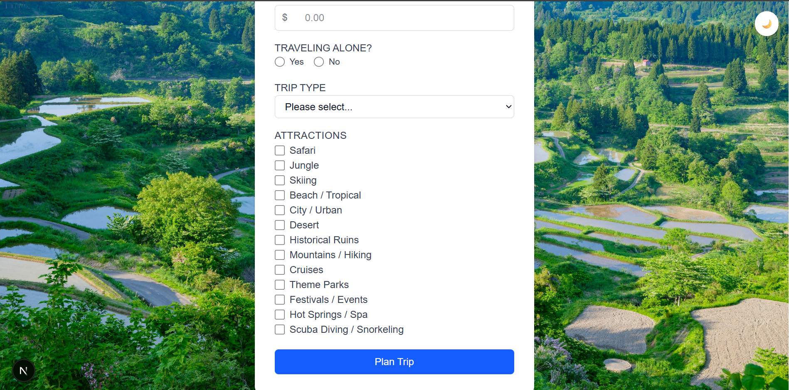
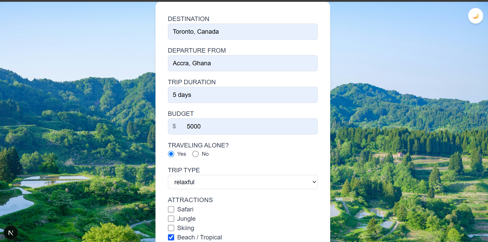
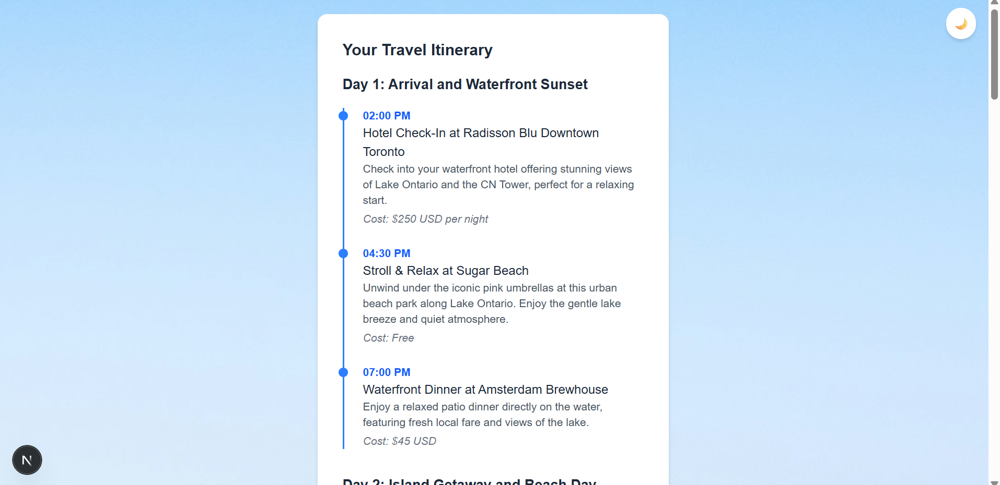
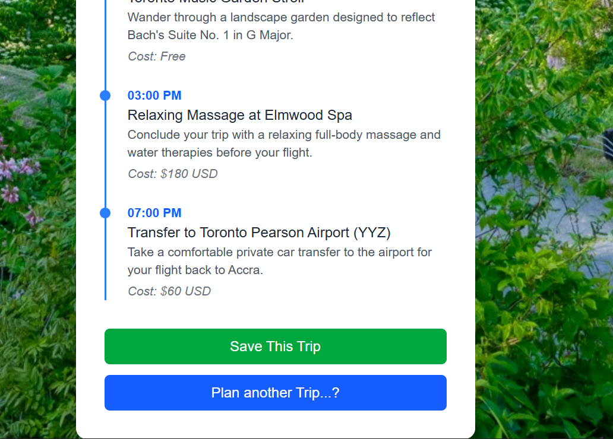

# AI Travel Planner

An AI-powered trip planning app that generates a personalized, day-by-day itinerary based on your destination, budget, trip style, and interests — then lets you save it for later

🔗 **Live demo:** [ai-travel-planner-h9b3c7htabhcefat.southafricanorth-01.azurewebsites.net](ai-travel-planner-h9b3c7htabhcefat.southafricanorth-01.azurewebsites.net)

🔗 **Live demo:** [](your-url-here)

## Features

- 🧳 **Personalized itinerary generation** — powered by Google's Gemini API, factoring in destination, departure point, trip duration, budget, travel companions, trip type, and selected attractions
- 🗺️ **Visual timeline view** — generated itineraries render as a clean, day-by-day vertical timeline with activities, times, and estimated costs
- 💾 **Save trips** — persist generated itineraries to a PostgreSQL database for later reference
- 🌗 **Dark / light mode** — respects your system preference by default, with a manual toggle override
- 📱 **Responsive design** — works cleanly across desktop and mobile screen sizes

## Tech Stack

- **Framework:** [Next.js](https://nextjs.org/) (App Router) with TypeScript
- **Styling:** [Tailwind CSS](https://tailwindcss.com/)
- **AI:** [Google Gemini API](https://ai.google.dev/)
- **Database:** PostgreSQL (hosted on Azure)
- **ORM:** [Prisma](https://www.prisma.io/)
- **Theming:** [next-themes](https://github.com/pacocoursey/next-themes)

## Getting Started

### Prerequisites

- Node.js (LTS version)
- A PostgreSQL database
- A Gemini API key ([Google AI Studio](https://aistudio.google.com/))

### Installation

1. Clone the repository

```bash
   git clone https://github.com/ebenmin/ai-travel-planner.git
   cd ai-travel-planner
```

2. Install dependencies

```bash
   npm install
```

3. Set up environment variables — create a `.env` file in the project root:
   DATABASE_URL="your-postgresql-connection-string"
   GEMINI_API_KEY="your-gemini-api-key"

4. Run database migrations

```bash
   npx prisma migrate dev
```

5. Start the development server

```bash
   npm run dev
```

6. Open [http://localhost:3000](http://localhost:3000) in your browser

## Roadmap

- [ ] View and browse previously saved trips
- [ ] User accounts / authentication
- [ ] Live deployment

## Screenshots













## License

This project is for portfolio/educational purposes.
